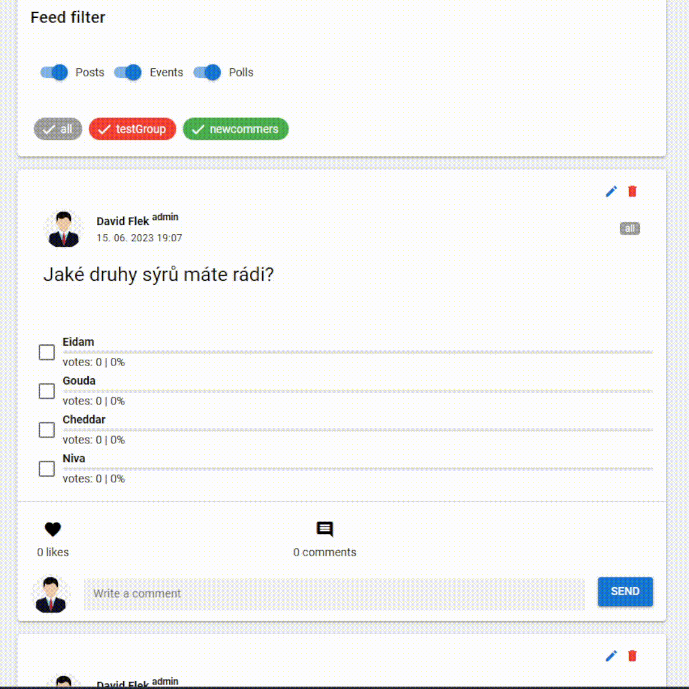

# Kin-ball app - Frontend
## About  
Bachelor thesis project.  
Goal of this app is to create a platform for a sports club to facilitate communication within the Kin-ball institute in Brno, among all teams and schools playing the sport. 

### Tech-stack
 - Vue 3 (composition API, script setup)
 - Quasar
 - Pinia
 - Typescript
 - Playwright (E2E test)

## Showcase
Feed of posts is lazy-loaded.

### Post - type event
<p align="center"></p>

### Post - type poll
<p align="center"></p>

There is much more to the app, I am just lazy creating these showcases.

# How to install and run
(You need the backend running)
## Install the dependencies
```bash
yarn
# or
npm install
```

### Start the app in development (hot-code reloading, error reporting, etc.)
```bash
npm run dev
```

### Build the app for production
```bash
npx quasar build
```

### Customize the configuration
See [Configuring quasar.config.js](https://v2.quasar.dev/quasar-cli-vite/quasar-config-js).
